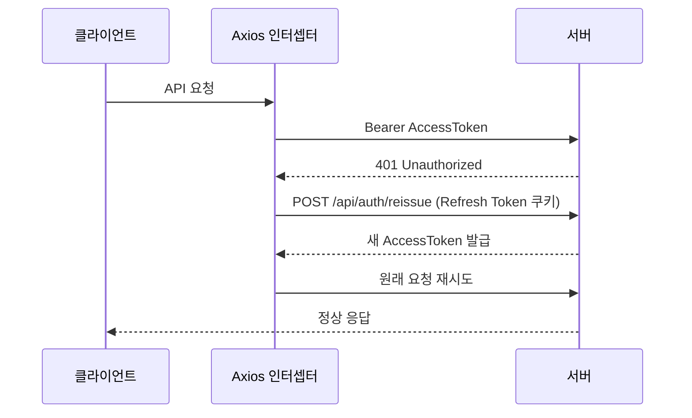

# 🤝 Dondok (돈독) — Frontend

> **함께 채우는 성실함의 가치, 지분 기반 습관 형성 플랫폼** <br/>
> Next.js 기반 모바일 퍼스트 웹 프론트엔드


<p align="center">
  
<br/>
  <strong>Dondok</strong>
<br/>
</p>

[](https://nextjs.org/)
[](https://www.typescriptlang.org/)
[](https://tailwindcss.com/)
[](https://zustand-demo.pmnd.rs/)
[](https://firebase.google.com/)
[](https://github.com/shadowwalker/next-pwa)
[](https://vercel.com/)


---

## 서비스 소개

Dondok은 크루원이 함께 보증금을 예치하고, 미션 인증 성실도에 따라 **실시간 지분율**이 변동하며 최종 환급금이 결정되는 습관 형성 플랫폼입니다. 단순 벌금제가 아닌 **참여도 = 수익률** 구조로, 함께 완주한 크루원 모두가 이익을 나눕니다.

**핵심 플로우**
크루 생성 (AI 도우미) → 보증금 예치 → 입장 신청/승인 → 매일 미션 인증 → 방장 검증 → 일일 정산 (지분율 갱신) → 미션 종료 → 최종 환급

## 주요 화면

| 화면 | 설명 |
|------|------|
| 크루 탐색 / 생성 | 카테고리·상태 필터, AI 도우미로 크루 자동 생성 |
| 미션 인증 업로드 | EXIF 검증 결과 실시간 표시, 카운트다운 타이머 |
| 인증 이력 | 탭별 필터, 날짜 그루핑, 커서 페이지네이션 |
| 실시간 지분율 대시보드 | 도넛 차트 + 예상 환급금 실시간 갱신 |
| 방장 운영 콘솔 | 인증 검증·가입 신청·공지관리 통합 관리 |
| 정산 결과 카드 | html-to-image 기반 PNG 저장·공유 |
| 도딘 지갑 | 잔액·예치금·내역 조회, Toss Payments 충전 |

## 기술적 특징

- **모바일 퍼스트 반응형**: max-w-[430px] 기준 모바일 최적화, PWA 설치 지원
- **JWT 자동 갱신**: 401 응답 시 Refresh Token으로 자동 재발급 후 원래 요청 재시도
- **HEIC 이미지 변환**: iOS 촬영 사진을 클라이언트에서 JPEG 변환 후 S3 직접 업로드
- **FCM 웹 푸시**: 백그라운드 상태에서도 알림 수신, 알림 클릭 시 딥링크 이동
- **결과 카드 저장**: html-to-image로 정산 결과를 PNG 이미지로 저장·공유



---

## 기술 스택

| 분류 | 기술 |
|------|------|
| Framework | Next.js 16.2.6 (App Router) |
| Runtime | React 19.2.4 |
| Language | TypeScript 5.x |
| Styling | Tailwind CSS 4.3.0 + clsx 2.1.1 + tailwind-merge 3.6.0 |
| State | Zustand 5.0.13 |
| HTTP | Axios 1.16.1 (JWT 자동 갱신 인터셉터) |
| Chart | Recharts 3.8.1 |
| Notification | Firebase 12.15.0 (FCM 웹 푸시) |
| PWA | next-pwa 5.6.0 |
| Image | heic2any 0.0.4 (HEIC→JPEG 변환) + html-to-image 1.11.13 (결과 카드 PNG 저장) |
| Security | DOMPurify 3.4.7 (XSS 방지) |
| Icon | Lucide React 1.16.0 |
| Test | tsx 기반 TypeScript 테스트 (src/**/*.test.ts) |
| Lint | ESLint 9.x |
| Deploy | Vercel (main 브랜치 자동 배포) |

---

## 폴더 구조

```
src/
├── api/                    # API 호출 관련 모듈 및 정의
├── app/                    # Next.js App Router 기반 페이지 구성
│   ├── (auth)/             # 로그인 · 회원가입 등 인증 처리 페이지
│   ├── crews/              # 크루 관련 페이지 (생성, 탐색, 상세 등)
│   ├── dashboard/          # 실시간 지분율 대시보드 페이지
│   ├── feed/               # 미션 인증 피드 페이지
│   ├── guide/              # 플랫폼 이용 가이드 페이지
│   ├── members/            # 멤버 정보 조회 페이지
│   ├── my/                 # 마이페이지 및 도딘 잔액/결제/내역 조회 페이지
│   ├── notifications/      # FCM 알림 목록 페이지
│   ├── oauth2/             # 소셜 로그인 OAuth2 리다이렉트 핸들러 페이지
│   ├── offline/            # PWA 오프라인 감지 대체 페이지
│   ├── profile/            # 프로필 수정 및 설정 페이지
│   ├── sandbox/            # 컴포넌트 및 기능 테스트용 샌드박스 페이지
│   └── settlements/        # 최종 정산 및 결과 카드 페이지
├── components/
│   ├── common/             # 공통 UI 컴포넌트 (Button, Input, Modal 등)
│   └── domain/             # 도메인별 특화 컴포넌트 (crew, feed, dashboard 등)
├── constants/              # 시스템 상수 및 설정 값 정의
├── hooks/                  # 리액트 커스텀 훅
├── lib/                    # 외부 라이브러리 및 SDK 설정 (Axios, Firebase FCM 등)
├── mocks/                  # 테스트 및 개발용 모킹 데이터/핸들러
├── services/               # 공통 비즈니스 로직 및 API 호출 서비스 레이어
├── store/                  # Zustand 전역 상태 관리 스토어
├── types/                  # TypeScript 공통 타입 정의
└── utils/                  # 공통 유틸리티 함수
```

---

## 배포

| 환경 | URL |
|------|-----|
| Production | https://dondok-fe.vercel.app |
| Preview | PR 생성 시 Vercel 봇이 자동 댓글로 URL 생성 |

- `main` 브랜치 머지 시 Vercel 자동 배포
- PR 생성 시 Preview URL 자동 생성 → E2E 테스트는 Preview URL로 진행
- 환경변수 추가 필요 시 전성에게 전달

---

<details>
<summary>로컬 개발 환경</summary>

### 요구사항
- Node.js 20+
- npm 10+ (Node.js 내장)

### 설치 및 실행

```bash
# 의존성 설치
npm install

# 환경 변수 설정
cp .env.example .env.local  # 또는 .env.local 직접 생성
# .env.local 에 NEXT_PUBLIC_API_BASE_URL 등 입력

# 개발 서버 실행
npm run dev
```

### 환경 변수

```env
NEXT_PUBLIC_API_BASE_URL=http://localhost:8080
NEXT_PUBLIC_FIREBASE_API_KEY=...
NEXT_PUBLIC_FIREBASE_PROJECT_ID=...
NEXT_PUBLIC_FIREBASE_MESSAGING_SENDER_ID=...
NEXT_PUBLIC_FIREBASE_APP_ID=...
NEXT_PUBLIC_VAPID_KEY=...
```

</details>

---

## Git 전략

| 브랜치 | 용도 |
|--------|------|
| `main` | 프로덕션 배포 (머지 시 Vercel 자동 배포) |
| `feat/{이슈번호}-{기능명}` | 기능 개발 |
| `hotfix` | 긴급 버그 수정 |

**작업 플로우:**
1. GitHub Issue 생성
2. 브랜치 생성 (`feat/{이슈번호}-{기능명}`)
3. 작업 후 commit / push
4. PR 생성 → Vercel Preview URL 자동 생성
5. Preview URL 직접 테스트
6. 리뷰 완료 후 Merge
7. main 자동 배포

- 커밋 컨벤션: `feat` / `fix` / `refactor` / `docs` / `test` / `chore`

---

## 팀원

| 훈련생 | 역할 | 담당 업무 |
|--------|------|-----------|
| 김세희 | PM · Team Lead | 피드 페이지 UI·피드 API 연동, 이모지 리액션 API 연동, HEIC 이미지 변환, 대시보드 UI·API 연동, 미션 종료·결과·결과 카드 저장 UI |
| 서일현 | Backend Lead | 대시보드 레이아웃 목업, 프로필 페이지 UI·API 연동, 도딘 충전 UI (Toss Payments 연동), 도딘 지갑 페이지 UI, 정산 상태/예외 화면 |
| 문창현 | DevOps Lead | 로그아웃 API 연결, 프로필 상태 메시지 버그 수정 |
| 김한비 | Backend Lead | FE 공통 구조 셋업 (types·axios·authStore·CLAUDE.md), 운영 콘솔 탭 UI, 인증 검증 탭 UI, 가입 신청 승인/거절 UI, 공지관리 탭 UI·API 연동, FCM 웹 푸시·알림 페이지·알림 설정 UI, 크루 해체 FE 연동 |
| 전성 | Frontend Lead | Next.js 초기화·Vercel 배포·PWA 서비스 워커, Tailwind 디자인 시스템·공통 컴포넌트, 로그인·회원가입 UI·API 연동, 크루 생성 5단계 폼·AI 도우미 UI, 크루 탐색·상세·입장 신청 UI, 미션 인증 업로드 UI, 인증 이력 UI, 대시보드 차트 |


---

## 관련 문서

- [백엔드 레포](https://github.com/OIT-Dondok/AIBE5_FinalProject_OIT_BE)
- Swagger UI (운영): http://43.203.87.248/swagger-ui/index.html
- 시스템 아키텍처 — 이미지 추가 예정
- ERD — 이미지 추가 예정
- 유즈케이스 다이어그램 — 이미지 추가 예정

<br/>
<p align="left">
  
</p>
